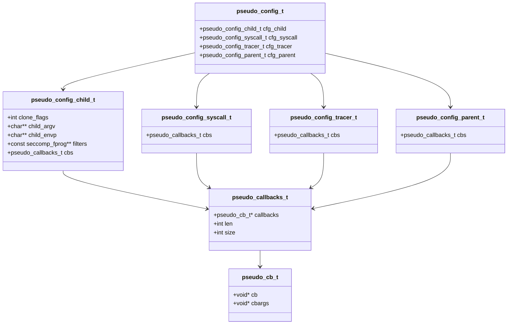
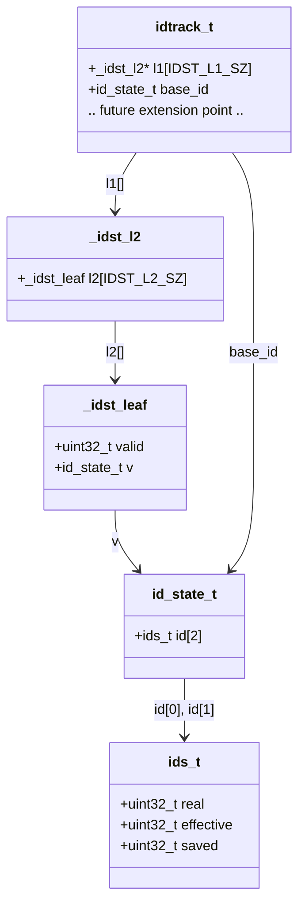

# Architecture Overview

This document summarizes the core data structures used by `libpseudo` and the
ID tracking subsystem.

## 1. `libpseudo` Configuration Model

`pseudo_config_t` is the top-level runtime configuration object. It groups
callback lists by execution phase:

- `cfg_child` for tracee setup
- `cfg_syscall` for syscall handling
- `cfg_tracer` for ptrace and waitpid event handling
- `cfg_parent` for parent-side setup after `clone`

Each phase owns a `pseudo_callbacks_t`. This is a growable array of
`pseudo_cb_t` entries. Each `pseudo_cb_t` stores a callback pointer and an
opaque argument pointer. This is the mechanism `libpseudo` uses to let callers
attach behavior at specific points in the tracing and emulation flow.

## 2. `idtrack_t` Sparse State Table

`idtrack_t` stores a sparse two-level table of `id_state_t` values, plus a
default `base_id`.

- `l1[]` is the top-level pointer table
- each populated `l1[i]` points to an `_idst_l2` block
- each `_idst_l2` contains a fixed `l2[]` array of `_idst_leaf`
- each `_idst_leaf` contains a `valid` flag and a stored `id_state_t`

`idtrack_t` is a client-owned state object. The current implementation stores
the sparse table and the default base state. Additional fields may be added in
the future without changing the two-level lookup structure.

The diagram below marks that extension point explicitly, but does not name or
imply any unimplemented field.

### `id_state_t` Payload

`id_state_t` stores two `ids_t` records:

- `id[0]` for user IDs
- `id[1]` for group IDs

This allows the tracker to store separate user and group state for each entry.

Each `ids_t` contains:

- `real`
- `effective`
- `saved`
