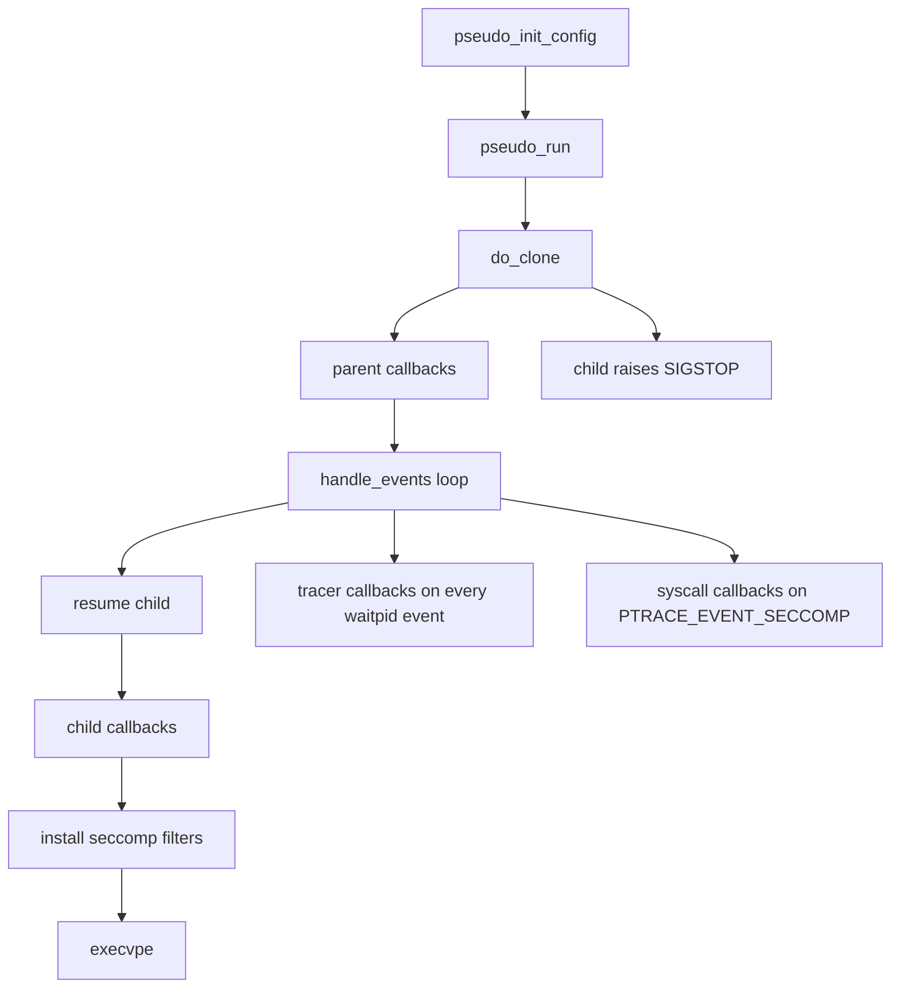
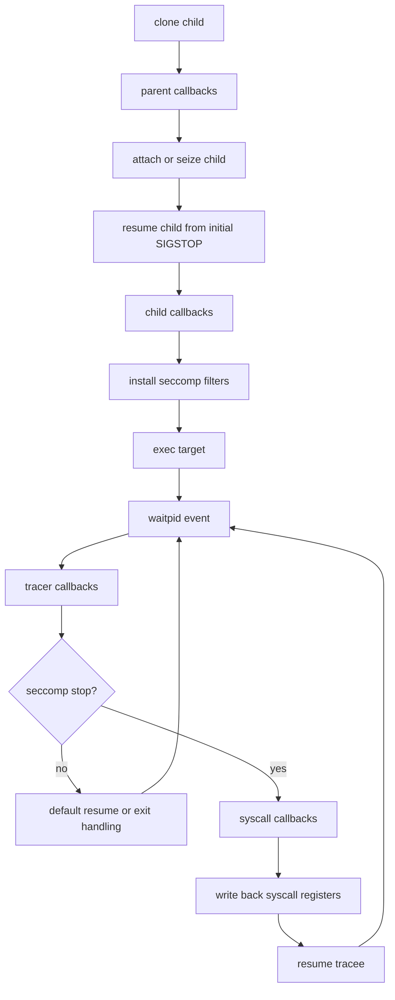

# `libpseudo` Runtime API

`libpseudo` runs a traced child process, lets callers attach callbacks at fixed
points in that lifecycle, and uses seccomp plus `ptrace` to intercept selected
syscalls.

## Core Types

`pseudo_config_t` is the top-level configuration object organized by callback
phase.

- `cfg_child` controls the cloned tracee before `exec`
- `cfg_syscall` holds callbacks for seccomp-triggered syscall interception
- `cfg_tracer` holds callbacks for every `waitpid()` event seen by the tracer
- `cfg_parent` holds callbacks that run in the parent immediately after
  `clone()`

Each phase owns a `pseudo_callbacks_t`:

- `callbacks` points at a growable array of `pseudo_cb_t`
- `len` is the number of active callback slots
- `size` is the current allocation capacity

`pseudo_cb_t` stores two opaque pointers:

- `cb` is the callback function pointer
- `cbargs` is the caller-owned context passed back to that callback

The callback signatures are phase-specific:

```C
typedef int (parent_cb_func_t)(pid_t child, void* cb_args);
typedef int (child_cb_func_t)(void* cb_args);
typedef int (tracer_cb_func_t)(pid_t child, int waitpid_status, void* cb_args);
typedef int (syscall_cb_func_t)(pid_t child, syscall_ctx_t* sc_args, void* cb_args);
```

## Lifecycle

The current runtime path is:

1. `pseudo_init_config()` zeroes the config and initializes all callback
   arrays.
2. `pseudo_run()` calls `do_clone()`.
3. The child enters `child_exec()`, raises `SIGSTOP`, and waits for the parent
   tracer to attach.
4. The parent runs every callback in `cfg_parent.cbs`.
5. `handle_events()` attaches with `PTRACE_SEIZE` or a fallback `PTRACE_ATTACH`
   path, then enters a `waitpid(__WALL)` loop.
6. When the child resumes from its initial stop, it runs every callback in
   `cfg_child.cbs`.
7. The child installs any configured seccomp filters, then calls `execvpe()`.
8. Every traced `waitpid()` event runs the callbacks in `cfg_tracer.cbs`.
9. Every `PTRACE_EVENT_SECCOMP` stop runs the callbacks in
   `cfg_syscall.cbs`, then writes the possibly modified syscall context back to
   the tracee.



## Callback Phase Order

The callback phases are exposed by the public API, but their ordering is
defined by the current implementation. As implemented now, the callback order
looks like this:



In short, the callback sequencing is:

```text
parent -> child -> tracer -> syscall when event == PTRACE_EVENT_SECCOMP
```

`syscall` is not a separate outer phase. It is entered from within the tracer
event loop only for seccomp-triggered stops.

## Configuration Functions

### `void pseudo_init_config(pseudo_config_t* cfg)`

Initializes a caller-provided config object.

Current behavior:

- zeroes the whole struct with `memset`
- allocates an initial callback array for each phase
- does not validate `cfg`

Call this before writing into any callback list or calling `pseudo_run()`.

### `void pseudo_free_config(pseudo_config_t* cfg)`

Releases the callback arrays owned by a config, then zeroes the struct.

Important ownership rule:

- this frees only the backing arrays for `pseudo_callbacks_t`
- it does not free `child_argv`, `child_envp`, `filters`, or any `cbargs`
  payloads supplied by the caller

## Callback Registration

### `void pseudo_cb_init(pseudo_callbacks_t* cbs)`

Initializes a standalone callback list. `pseudo_init_config()` already does
this for every list embedded in `pseudo_config_t`.

### `void pseudo_cb_free(pseudo_callbacks_t* cbs)`

Frees the callback array and resets `len` and `size` to zero.

### `void pseudo_cb_add(pseudo_callbacks_t* cbs, void* cb, void* cb_args)`

Appends one callback record.

### `void pseudo_cb_adds(pseudo_callbacks_t* cbs, const pseudo_cb_t* pseudo_cb)`

Appends a pre-built `pseudo_cb_t`.

Registration notes:

- callbacks run in insertion order
- the library stores raw `void*` function pointers and does not type-check
  phase compatibility
- capacity grows in fixed chunks of eight entries
- allocation failure is fatal and terminates through `die()`

## Running the Runtime

### `int pseudo_run(pseudo_config_t* cfg)`

Starts the traced child and runs the parent/tracer loop.

Expected inputs:

- `cfg->cfg_child.child_argv` must name the target program in
  `child_argv[0]`, because `child_exec()` passes it to `execvpe()`
- `cfg->cfg_child.child_envp` is optional; when it is `NULL`, the child uses
  the current process `environ`
- `cfg->cfg_child.filters` is optional; when present it must be a
  null-terminated array of `const seccomp_fprog*`
- `cfg->cfg_child.clone_flags` is OR-ed into `clone(..., SIGCHLD | flags, ...)`

Current failure model:

- most operational errors call `die()` and terminate the process
- callback return values are treated as fatal if non-zero
- `pseudo_run()` returns `0` on the success path after the event loop exits

## Callback Phase Semantics

### Parent callbacks

Parent callbacks run after `clone()` succeeds and before the main event loop.
They receive the child PID and are the right place for tracer-side setup that
depends on the child already existing.

### Child callbacks

Child callbacks run in the cloned child after the initial stop and before
seccomp installation and `execvpe()`. Use this phase for tracee-local setup
such as environment mutation, namespace setup, or other pre-exec state changes.

### Tracer callbacks

Tracer callbacks run on every `waitpid(__WALL)` event before the default event
handling logic decides whether to resume, ignore, or treat the event as a
seccomp stop.

### Syscall callbacks

Syscall callbacks run only on `PTRACE_EVENT_SECCOMP`. They receive a mutable
`syscall_ctx_t`, so they can rewrite syscall numbers, arguments, or return
values before `syscall_set_regs()` writes the state back.

## Practical Constraints

- The event loop always runs, even if no callbacks are registered.
- `libpseudo` currently assumes one traced process tree rooted at the child
  returned by `clone()`.
- The implementation treats callback failures as unrecoverable. If a module
  wants soft-failure behavior, it must encode that internally and still return
  `0`.
- `pseudo_free_config()` is safe only after the runtime is no longer using the
  callback arrays.
